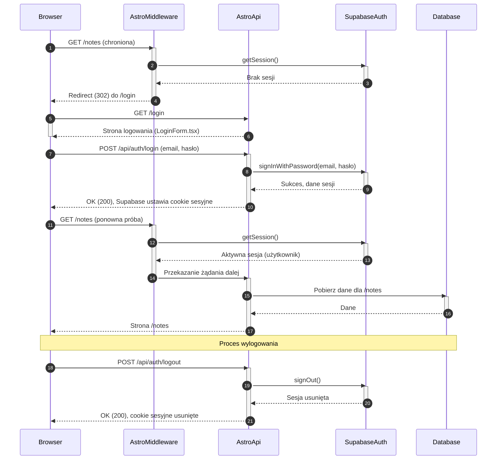

<authentication_analysis>
1.  **Przepływy autentykacji:**
    *   **Logowanie użytkownika:** Użytkownik podaje e-mail i hasło, które są weryfikowane przez Supabase. W przypadku powodzenia, tworzona jest sesja.
    *   **Rejestracja nowego użytkownika:** Użytkownik podaje e-mail i hasło. Supabase tworzy konto i wysyła e-mail weryfikacyjny.
    *   **Wylogowanie:** Sesja użytkownika jest unieważniana.
    *   **Dostęp do chronionych zasobów:** Middleware sprawdza sesję przed udzieleniem dostępu.
    *   **Aktualizacja ustawień (API Key):** Zalogowany użytkownik może zapisać swój klucz API.

2.  **Główni aktorzy i ich interakcje:**
    *   **Użytkownik (Przeglądarka):** Inicjuje akcje logowania, rejestracji, wylogowania i dostępu do stron.
    *   **Astro (Frontend/Backend):** Renderuje strony i komponenty, obsługuje żądania API.
    *   **Middleware Astro:** Przechwytuje żądania, weryfikuje sesje i zarządza przekierowaniami.
    *   **Supabase Auth:** Obsługuje operacje na użytkownikach (tworzenie, logowanie) i zarządza sesjami (tokeny JWT w cookies).
    *   **Baza danych (Supabase/Postgres):** Przechowuje dane profili użytkowników, w tym zaszyfrowany klucz API.

3.  **Procesy weryfikacji i odświeżania tokenów:**
    *   Biblioteka `@supabase/auth-helpers-astro` automatycznie zarządza cyklem życia tokenów (JWT).
    *   Tokeny (access token i refresh token) są przechowywane w bezpiecznych, serwerowych ciasteczkach (`httpOnly`).
    *   Gdy `access token` wygasa, `auth-helpers` automatycznie używa `refresh token` do uzyskania nowego `access token` od Supabase Auth. Ten proces jest transparentny dla użytkownika. Middleware przy każdym żądaniu do chronionego zasobu ma dostęp do aktualnej sesji.

4.  **Opis kroków autentykacji:**
    *   **Logowanie:** Przeglądarka wysyła POST do `/api/auth/login` -> Astro API wywołuje `supabase.auth.signInWithPassword` -> Supabase Auth weryfikuje dane i jeśli są poprawne, ustawia ciasteczka sesji.
    *   **Dostęp do chronionej strony:** Przeglądarka żąda np. `/notes` -> Middleware przechwytuje żądanie -> Middleware używa `supabase.auth.getSession()` do weryfikacji sesji z ciasteczka -> Jeśli sesja jest ważna, dostęp jest udzielany. Jeśli nie, następuje przekierowanie do `/login`.
</authentication_analysis>

<mermaid_diagram>

</mermaid_diagram>
