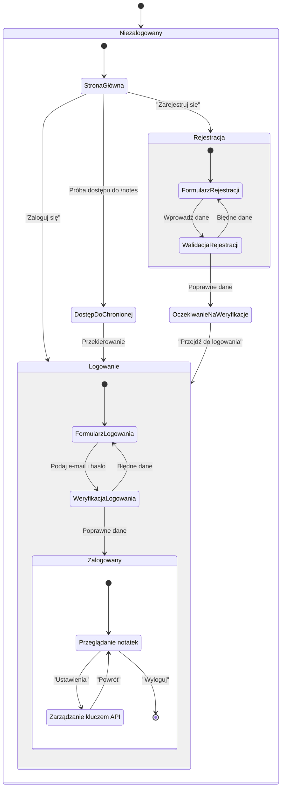

<user_journey_analysis>
1.  **Ścieżki użytkownika:**
    *   **Nowy użytkownik:** Odwiedza stronę -> Przechodzi do rejestracji -> Wypełnia formularz -> Otrzymuje e-mail weryfikacyjny -> Klika link weryfikacyjny -> Loguje się.
    *   **Powracający użytkownik (niezalogowany):** Odwiedza stronę -> Próbuje uzyskać dostęp do chronionej sekcji -> Jest przekierowany do logowania -> Loguje się -> Uzyskuje dostęp.
    *   **Zalogowany użytkownik:** Korzysta z aplikacji (np. tworzy notatki) -> Przechodzi do ustawień -> Zarządza kluczem API -> Wylogowuje się.
    *   **Błędne logowanie/rejestracja:** Użytkownik podaje nieprawidłowe dane i otrzymuje komunikat o błędzie.

2.  **Główne podróże i stany:**
    *   **Gość (Niezalogowany):** Przeglądanie stron publicznych.
    *   **Autentykacja:** Proces logowania lub rejestracji.
    *   **Użytkownik (Zalogowany):** Dostęp do pełnej funkcjonalności aplikacji.
    *   **Oczekiwanie na weryfikację:** Stan po rejestracji, przed potwierdzeniem e-maila.

3.  **Punkty decyzyjne:**
    *   Czy użytkownik ma konto? (decyduje między logowaniem a rejestracją)
    *   Czy dane logowania są poprawne?
    *   Czy dane rejestracyjne są poprawne?
    *   Czy sesja jest aktywna? (decyzja w middleware)
    *   Czy e-mail został zweryfikowany?

4.  **Cel każdego stanu:**
    *   **Strona Główna (Publiczna):** Pierwszy kontakt z aplikacją.
    *   **Formularz Rejestracji:** Zebranie danych do utworzenia konta.
    *   **Oczekiwanie na Weryfikację:** Informowanie użytkownika o konieczności potwierdzenia e-maila.
    *   **Formularz Logowania:** Umożliwienie zalogowania się.
    *   **Panel Użytkownika (`/notes`):** Główna funkcjonalność aplikacji dla zalogowanych.
    *   **Ustawienia:** Zarządzanie danymi profilowymi (klucz API).
</user_journey_analysis>

<mermaid_diagram>

</mermaid_diagram>
