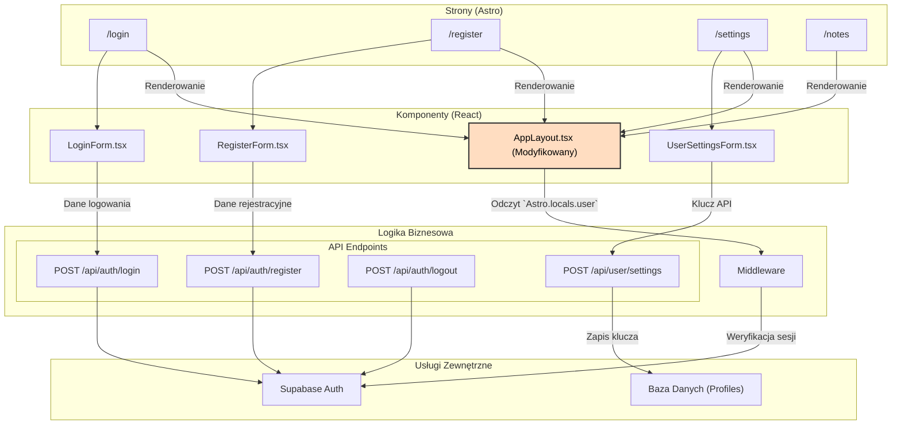

<architecture_analysis>

1.  **Komponenty:**
    - **Strony Astro (Nowe):** `/login`, `/register`, `/settings`, `/auth/callback`.
    - **Komponenty React (Nowe):** `LoginForm.tsx`, `RegisterForm.tsx`, `UserSettingsForm.tsx`.
    - **Layout (Modyfikowany):** `AppLayout.tsx` (logika warunkowa auth/non-auth).
    - **Komponent (Modyfikowany):** `ProfileToolbar.tsx` (dodany przycisk wylogowania).
    - **Endpointy API (Nowe):** `/api/auth/login`, `/api/auth/register`, `/api/auth/logout`, `/api/user/settings`.

2.  **Strony i ich komponenty:**
    - Strona `/login` renderuje `LoginForm.tsx`.
    - Strona `/register` renderuje `RegisterForm.tsx`.
    - Strona `/settings` renderuje `UserSettingsForm.tsx`.
    - Wszystkie strony aplikacji są owinięte w `Layout.astro`, który z kolei używa `AppLayout.tsx`.

3.  **Przepływ danych:**
    - Formularze (`LoginForm`, `RegisterForm`) wysyłają dane (e-mail, hasło) do odpowiednich endpointów API.
    - Endpointy API komunikują się z Supabase Auth.
    - Middleware odczytuje stan sesji i przekazuje informacje o użytkowniku do `Astro.locals`.
    - `AppLayout.tsx` odczytuje dane użytkownika z `Astro.locals` (przekazane z `Layout.astro`) w celu warunkowego renderowania elementów UI (np. przycisk Wyloguj).
    - `UserSettingsForm.tsx` wysyła klucz API do endpointu `/api/user/settings`.

4.  **Funkcjonalność komponentów:**
    _ **`LoginForm.tsx`:** Formularz logowania z walidacją `zod`, obsługą błędów i komunikacją z API.
    _ **`RegisterForm.tsx`:** Formularz rejestracji z walidacją `zod`, obsługą błędów i komunikacją z API.
    _ **`UserSettingsForm.tsx`:** Formularz do zarządzania kluczem API.
    _ **`AppLayout.tsx`:** Główny layout aplikacji, dostosowujący widok w zależności od stanu zalogowania.
    </architecture_analysis>

<mermaid_diagram>

</mermaid_diagram>
